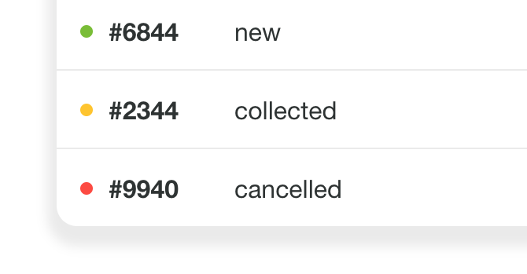

## Orders (Randomize with brain)

Goal pursuit: it always has to make sense. 

### Start

    npm install && npm start

### 🎁 TODO 💤 🤸

- [ ]  Single container: Metrics / Statics / Actions
    - [ ] Top n of products
    - [ ] Hot Hours
    - [ ] Total earned 
    - [ ]  CRUD: Items
    - [ ] Items by hours
    - [ ] Close the store (disable or change state of container)
    - [ ] Generated state(context) for container(store) ex: object of nº Items (price, name, etc)

- [ ] Can create more containers (CRUD) (TODO def)
- [ ] Global context: Metrics / Statics / Actions / Filters
